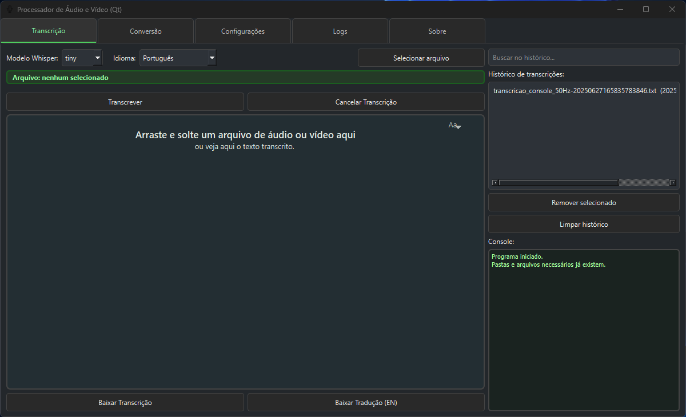
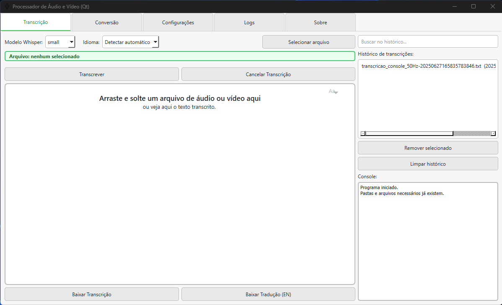

# Processador de Áudio e Vídeo (Qt) - Versão 3.0

Aplicativo desktop para transcrição automática de arquivos de áudio e vídeo, conversão de formatos e análise de voz, com interface gráfica Qt.
Nesta nova versão, foram implementadas melhorias no projeto, como adição de console na aba de Transcrição, inserção de tema claro, melhoria no tratamento de de dados para conversão de arquivos, dentre outras melhorias.


---

## ✨ Novidades da Versão Atual

- **Tema claro e escuro**: Interface adaptável para melhor experiência visual.
- **Destaque visual adaptativo**: Mensagens e seleções com cores apropriadas para cada tema.
- **Transcrição com Whisper**: Modelos tiny, base, small, medium, large.
- **Diarização de falantes**: Identificação de locutores usando Resemblyzer.
- **Conversão de formatos**: De vídeo para áudio e outros formatos.
- **Download de vídeos do YouTube**: Utilizando yt-dlp.
- **Histórico pesquisável de transcrições**: Com gerenciamento e busca.
- **Mensagens de status com cores adaptativas**: Progresso, cancelamento e erros destacados corretamente.
- **Correção de bugs e melhorias no uso em diferentes máquinas**.
- **Configurações persistentes**: Em arquivo `config.json`.
- **Aba de logs detalhados**: Visualização direta na interface.
- **Fonte adaptativa**: Tamanho de fonte para transcrição, adaptável pelo usuário.
- **Abertura de prompt**: Abertura do prompt de comando durante execução resolvida.


---

## 🖼️ Demonstração

**Tela de Transcrição - interface escura**
<p align="center">

</p>

**Tela de Transcrição - interface clara**
<p align="center">

</p>

---

## ⚙️ Requisitos

- Python **3.10.10**
- [PyQt6](https://pypi.org/project/PyQt6/)
- [openai-whisper](https://github.com/openai/whisper)
- [ffmpeg](https://ffmpeg.org/) (instalado no PATH ou baixado automaticamente)
- [yt-dlp](https://github.com/yt-dlp/yt-dlp)
- [resemblyzer](https://github.com/resemble-ai/Resemblyzer)
- Outros: tqdm, numpy, scikit-learn, etc. (veja `requirements.txt`)

---

## 🚀 Instalação e Uso

### 1. Clone o repositório

```bash
git clone https://github.com/allysonalmeidaa/Processador_Audio_Video_Qt.git
cd Processador_Audio_Video_Qt
```

### 2. Crie e ative o ambiente virtual

```bash
py -3.10 -m venv .venv
# Windows:
.venv\Scripts\activate
```
### 3. Instale as dependências

```bash
pip install -r requirements.txt
```

### 4. Execute o aplicativo

```bash
python Transcricao_main_V3.py
```

Ou, para gerar um executável (Windows):

```bash
pyinstaller Transcricao_main_V3.spec
```
O executável estará na pasta `dist/`.

---

## 📦 Organização do Projeto

- `Transcricao_main_V3.py` : inicialização e controle da interface principal
- `Transcricao_tab_V3.py` : aba de transcrição
- `Transcricao_conversão_tab_V3.py` : aba de conversão de arquivos
- `Transcricao_core_V3.py` : lógica de transcrição com Whisper e diarização
- `Processamento_video.py` : lógica de conversão de arquivos para outros formatos
- `logs_tab.py` : aba de logs de erros e eventos
- `ffmpeg_utils.py` : verificação e download automático do ffmpeg
- `erros_usuarios.py` : mensagens de erro amigáveis
- `diarizacao_resemblyzer.py` : diarização e similaridade de voz 
- `config.json`, `historico.json` : arquivos de configuração e histórico
- `erros_usuarios.json` : registro de erros do usuário

---

## 📝 Funcionalidades

- Transcrição automática de áudio/vídeo com Whisper
- Diarização de locutores
- Conversão de formatos de mídia
- Download de vídeos do YouTube
- Análise de similaridade de voz
- Interface gráfica intuitiva com tema claro e escuro
- Histórico de transcrições pesquisável e editável
- Feedback visual em todas as operações
- Mensagens de status coloridas por contexto (progresso, erro, cancelamento)
- Configuração de modelo, idioma e preferências persistentes

---

## 🛠️ Dicas e Solução de Problemas

- Se houver problemas com o ffmpeg, o programa tentará baixar automaticamente. Se falhar, baixe manualmente de [ffmpeg.org](https://ffmpeg.org/) e coloque na pasta informada pelo erro.
- Em caso de erros ou comportamentos inesperados, consulte a aba **Logs** da interface.

---

## 🙏 Créditos

- [OpenAI Whisper](https://github.com/openai/whisper)
- [yt-dlp](https://github.com/yt-dlp/yt-dlp)
- [Resemblyzer](https://github.com/resemble-ai/Resemblyzer)
---

## 👤 Autor

Desenvolvido por [Allyson Almeida Sirvano](https://github.com/allysonalmeidaa)  
Orientação: Mauricio Menon

---