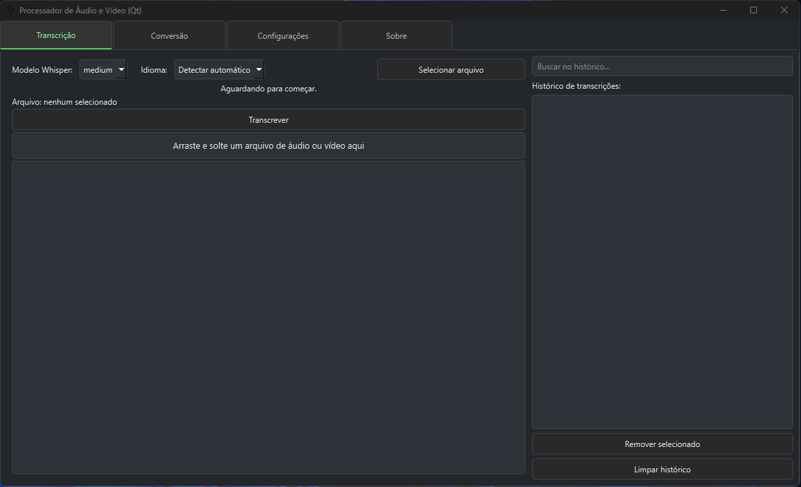
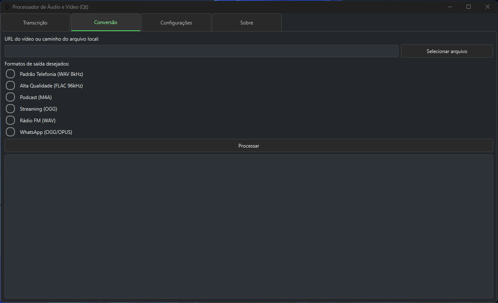

# Processamento de Áudio e Vídeo (Qt)

Aplicativo desktop para transcrição automática de arquivos de áudio e vídeo, utilizando o modelo Whisper da OpenAI, e conversão de arquivos de áudio para diferentes formatos, com interface gráfica (PyQt6).

---

## 🖼️ Demonstração

**Tela Principal:**


**Tela :**


---

## ✨ Funcionalidades

- Transcrição de áudio e vídeo usando modelos OpenAI Whisper (tiny, base, small, medium, large)
- Diarização de áudio com pyannote-audio (identificação de diferentes locutores)
- Interface gráfica amigável em tema escuro
- Suporte a múltiplos idiomas de transcrição
- Arraste e solte arquivos para transcrição
- Histórico de transcrições com busca e gerenciamento
- Conversão de vídeos para múltiplos formatos de áudio
- Conversão e download direto de vídeos do YouTube via yt-dlp
- Barra de progresso e feedback detalhado durante o processamento
- Configurações salvas automaticamente

---

## ⚙️ Requisitos

- Python **3.10.10**
- [PyQt6](https://pypi.org/project/PyQt6/)
- [openai-whisper](https://github.com/openai/whisper) (para transcrição de arquivo de áudio)
- [pyannote-audio](https://github.com/pyannote/pyannote-audio) (para diarização de áudio)
- [ffmpeg](https://ffmpeg.org/) (instalado e no PATH do sistema)
- [yt-dlp](https://github.com/yt-dlp/yt-dlp) (para baixar vídeos do YouTube)
- Outros: tqdm, numpy, etc. (consulte `requirements.txt`)

---

## 🚀 Instalação

1. Clone este repositório:
   ```bash
   git clone https://github.com/allysonalmeidaa/Processador_Audio_Video_Qt.git
   cd Processador_Audio_Video_Qt
   ```

2. (Opcional) Crie um ambiente virtual na versão 3.10.10 do python:
   ```bash
   python3.10.10 -m venv .venv
   venv\Scripts\activate     
   ```

3. Instale as dependências:
   ```bash
   pip install -r requirements.txt
   ```

4. Certifique-se de que o `ffmpeg` está instalado e disponível no PATH.

---

## 🔑 Configuração do Token pyannote

Para utilizar o projeto, deve ser configurada as funcionalidades de diarização (identificação de locutores), é necessário um **token pessoal do pyannote**.

1. Acesse o [repositório pyannote/pyannote-audio](https://github.com/pyannote/pyannote-audio) e siga as instruções para criar sua conta e gerar seu token de acesso.
2. Crie um arquivo chamado `.env` na raiz do projeto (mesmo diretório do `README.md`).
3. Adicione ao arquivo `.env` a seguinte linha, substituindo pelo seu token:
   ```
   HUGGINGFACE_TOKEN = seu_token_aqui
   ```

> **Atenção:**  
> Nunca compartilhe seu token pessoal publicamente.  
> Se o token não estiver configurado corretamente, as funções de diarização a interface não irá ter a funcionalidade de transcrição.

---

## 🖥️ Como usar

1. Execute o aplicativo principal:
   ```bash
   python Transcricao_main_V3.py
   ```

2. Na interface, selecione o modelo Whisper, idioma e arquivo desejado.

3. Use o botão **Transcrever** ou arraste e solte um arquivo na área destacada.

4. Consulte e gerencie o histórico de transcrições na lateral direita.

5. Para converter vídeos/áudios para outros formatos de arquivo, utilize a aba **Conversão** — é possível utilizar arquivos locais, além de ser possível informar um link do YouTube para baixar e converter automaticamente para o formato desejado.

---

## ⚙️ Configuração

- As preferências do usuário (modelo padrão, idioma, pasta de saída, etc.) são salvas automaticamente no arquivo `config.json`.
- O histórico de transcrições é salvo em `historico.json`.

---

## 📦 Organização do Projeto

- `Transcricao_main_V3.py`: inicialização e controle da interface principal
- `Transcricao_tab_V3.py`: aba de transcrição
- `Transcricao_conversão_tab_V3.py`: aba de conversão de arquivos
- `Transcricao_core_V3.py`: lógica de transcrição com Whisper e diarização
- `config.json`, `historico.json`: arquivos de configuração e histórico

---

## 🙏 Referências e Créditos

Este projeto faz uso ou se inspira em funções/códigos de outros repositórios. Agradecimentos especiais a:

- [openai/whisper](https://github.com/openai/whisper) — engine principal de transcrição de áudio e vídeo.
- [pyannote/pyannote-audio](https://github.com/pyannote/pyannote-audio) — diarização de áudio (identificação de locutores).
- [yt-dlp/yt-dlp](https://github.com/yt-dlp/yt-dlp) — download e conversão de vídeos do YouTube.

---

## 👤 Autor

Desenvolvido por [Allyson Almeida Sirvano](https://github.com/allysonalmeidaa)  
Sob orientação de Mauricio Menon

---