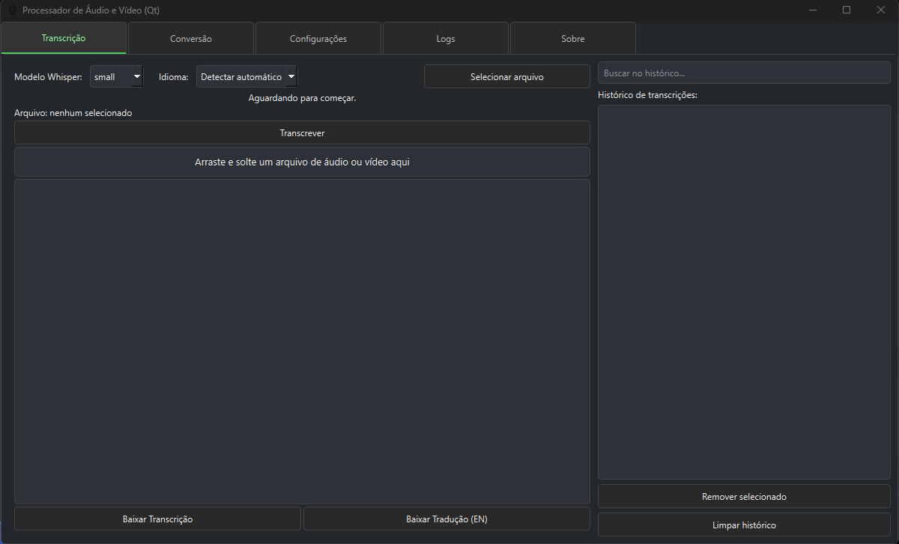
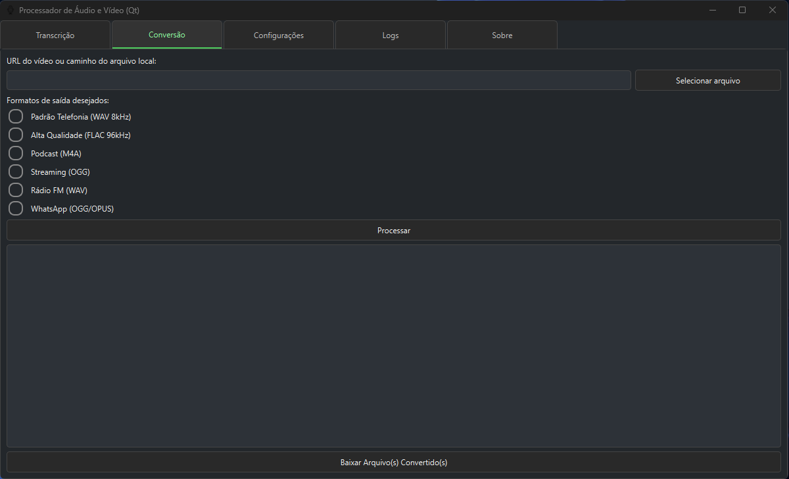

# Processador de Áudio e Vídeo (Qt) — Versão 2.0

Aplicativo desktop para transcrição automática de arquivos de áudio e vídeo, conversão de formatos e análise de voz, com interface gráfica Qt.  
Esta nova versão traz robustez, portabilidade, dependências atualizadas e empacotamento profissional, além de diversas melhorias funcionais e de experiência do usuário.

---

## 🆕 Principais melhorias e mudanças nesta versão

- **Ambiente virtual padronizado**: uso recomendado de `.venv` para ambientes Python isolados e reprodutíveis.
- **Empacotamento via PyInstaller**: executável Windows pronto para uso sem necessidade de Python instalado.
- **Requirements.txt atualizado**: dependências revisadas e enxutas.
- **Gestão automática de assets**: assets do Whisper, Resemblyzer e outros incluídos na build.
- **Organização de arquivos**: estrutura de projeto clara, com histórico, transcrições e configurações salvos em arquivos dedicados.
- **Interface aprimorada**: melhorias de usabilidade, responsividade e feedback visual.
- **Compatibilidade ampliada**: funcionamento garantido em ambientes Windows limpos.
- **Documentação revisada**: instruções claras de instalação, uso e build do executável.

---

## 🖼️ Demonstração

**Tela Principal:**


**Tela de Conversão:**


---

## ✨ Funcionalidades

- Transcrição de áudio e vídeo com modelos Whisper (tiny, base, small, medium, large)
- Diarização de áudio (identificação de locutores) com Resemblyzer
- Conversão de vídeos para múltiplos formatos de áudio
- Download direto de vídeos do YouTube via yt-dlp
- Análise de similaridade de voz (Resemblyzer)
- Interface gráfica intuitiva em tema escuro
- Suporte a múltiplos idiomas
- Arraste e solte arquivos para transcrição
- Histórico de transcrições pesquisável e gerenciável
- Barra de progresso e feedback detalhado
- Configurações persistentes em arquivo

---

## ⚙️ Requisitos

- Python **3.10.10**
- [PyQt6](https://pypi.org/project/PyQt6/)
- [openai-whisper](https://github.com/openai/whisper)
- [ffmpeg](https://ffmpeg.org/) (pode estar instalado no PATH do sistema ou será gerado um ao utilizar o executável)
- [yt-dlp](https://github.com/yt-dlp/yt-dlp)
- Outros: tqdm, numpy, scikit-learn, resemblyzer, etc. (veja `requirements.txt`)

---

## 🚀 Instalação e Uso

### 1. Clone o repositório
```bash
git clone https://github.com/allysonalmeidaa/Processador_Audio_Video_Qt.git
cd Processador_Audio_Video_Qt
```

### 2. Crie e ative o ambiente virtual
```bash
py -3.10 -m venv .venv   
# Windows:
.venv\Scripts\activate

### 3. Instale as dependências
```bash
pip install -r requirements.txt
```

### 4. Certifique-se de que o `ffmpeg` está instalado e disponível no PATH caso utilizar no próprio terminal, caso o contrário, o executável irá efetuar o download do `ffmpeg`.

### 5. Gere o executável (.exe) (opcional, Windows)
```bash
pyinstaller transcricao_main_V3.spec
```
O executável estará na pasta `dist/`.

### 6. Execute o aplicativo
- Via Python:
  ```bash
  python Transcricao_main_V3.py
  ```
- Via executável:
  - Dê duplo clique no arquivo `.exe` gerado em `dist/`.

---

### 📦 Organização do Projeto

- `Transcricao_main_V3.py` : inicialização e controle da interface principal
- `Transcricao_tab_V3.py` : aba de transcrição
- `Transcricao_conversão_tab_V3.py` : aba de conversão de arquivos
- `Transcricao_core_V3.py` : lógica de transcrição com Whisper e diarização
- `Processamento_video.py` : lógica de conversão de arquivos para outros formatos
- `logs_tab.py` : aba de logs de erros que podem ocorrer na utilização do programa
- `ffmpeg_utils.py` : lógica para verificação de existência ffmpeg no PATH do sistema, e download de ffmpeg caso contrário 
- `erros_usuarios.py` : lógica para gerar descrições de erros mais amigáveis
- `diarizacao_resemblyzer.py` : lógica para diarização e similaridade de voz 
- `config.json`, `historico.json` : arquivos de configuração e histórico
- `erros_usuarios.json` : registro de erros do usuário para depuração e melhorias

> Os arquivos acima são os principais para o funcionamento, configuração e histórico do sistema.  
> Outros scripts e pastas servem para funcionalidades complementares ou desenvolvimento.
---

---

## 🙏 Referências e Créditos

- [openai/whisper](https://github.com/openai/whisper)
- [yt-dlp/yt-dlp](https://github.com/yt-dlp/yt-dlp)
- [resemblyzer](https://github.com/resemble-ai/Resemblyzer)

---

## 👤 Autor

Desenvolvido por [Allyson Almeida Sirvano](https://github.com/allysonalmeidaa)  
Sob orientação de Mauricio Menon

---

