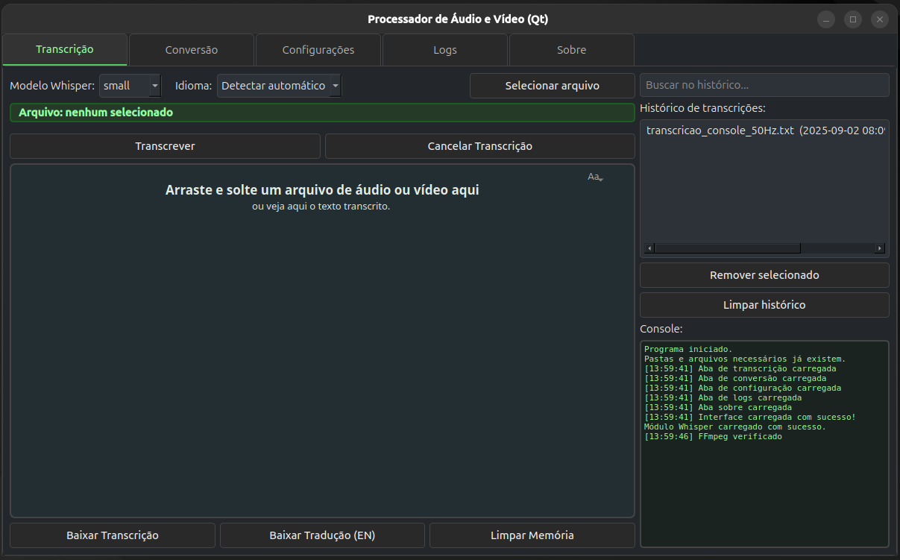
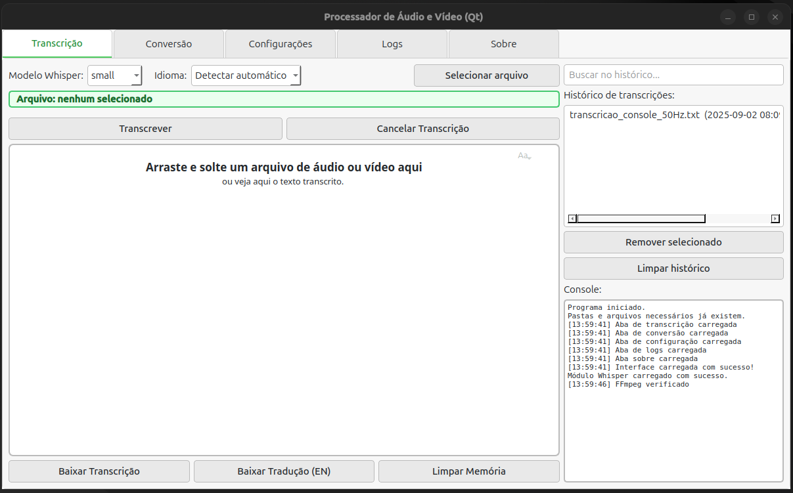

# Processador de Áudio e Vídeo (Qt) - Versão 3.2
 
Aplicativo desktop para transcrição automática de arquivos de áudio e vídeo, conversão de formatos e análise de voz, com interface gráfica Qt.
 
---
 
## 🐧 Suporte Linux — Novidade!
 
A partir desta versão, o projeto foi **portado para Linux**! Foram realizadas adaptações de código e ajustes necessários para compatibilidade com ambientes Linux, incluindo dependências, execução e comportamento do aplicativo.
 
> **Observação:**  
> As alterações realizadas priorizaram a compatibilidade Linux. Ainda não foi realizada uma bateria completa de testes no Windows após essas mudanças. Recomenda-se, caso utilize Windows, utilizar a versão anterior ou aguardar por testes oficiais.
 
---
 
## ✨ Novidades da Versão Atual
 
- **Portabilidade para Linux:**  
  O aplicativo agora pode ser executado em sistemas Linux, mediante adaptações de código e dependências.
- **Tema claro e escuro:** Interface adaptável para melhor experiência visual.
- **Destaque visual adaptativo:** Mensagens e seleções com cores apropriadas para cada tema.
- **Transcrição com Whisper:** Modelos tiny, base, small, medium, large.
- **Diarização de falantes:** Identificação de locutores usando Resemblyzer.
- **Conversão de formatos:** De vídeo para áudio e outros formatos.
- **Download de vídeos do YouTube:** Utilizando yt-dlp.
- **Histórico pesquisável de transcrições:** Com gerenciamento e busca.
- **Mensagens de status com cores adaptativas:** Progresso, cancelamento e erros destacados corretamente.
- **Correção de bugs e melhorias no uso em diferentes máquinas.**
- **Configurações persistentes:** Em arquivo `config.json`.
- **Aba de logs detalhados:** Visualização direta na interface.
- **Fonte adaptativa:** Tamanho de fonte para transcrição, adaptável pelo usuário.
- **Abertura de prompt:** Abertura do prompt de comando durante execução resolvida.
- **Ajustes em scripts:** Ajustes realizados para diminuição do tamanho do arquivo .exe gerado (Windows).
 
---
 
## 🖼️ Demonstração
 
**Tela de Transcrição - interface escura**
<p align="center">

</p>
 
**Tela de Transcrição - interface clara**
<p align="center">

</p>
 
---
 
## ⚙️ Requisitos
 
- Python **3.10.10**
- [PyQt6](https://pypi.org/project/PyQt6/)
- [openai-whisper](https://github.com/openai/whisper)
- [ffmpeg](https://ffmpeg.org/) (instalado no PATH ou baixado automaticamente)
- [yt-dlp](https://github.com/yt-dlp/yt-dlp)
- [resemblyzer](https://github.com/resemble-ai/Resemblyzer)
- Outros: tqdm, numpy, scikit-learn, etc. (veja `requirements.txt`)
 
---
 
## 🚀 Instalação e Uso
 
### 1. Clone o repositório
 
```bash
git clone https://github.com/allysonalmeidaa/Processador_Audio_Video_Qt.git
cd Processador_Audio_Video_Qt
```
 
### 2. Crie e ative o ambiente virtual
 
#### No **Windows**:
```bash
py -3.10 -m venv .venv
.venv\Scripts\activate
```
 
#### No **Linux**:
```bash
python3.10 -m venv .venv
source .venv/bin/activate
```
 
### 3. Instale as dependências
 
```bash
pip install -r requirements.txt
```
 
### 4. Execute o aplicativo
 
#### Windows:
```bash
python Transcricao_main_V3.py
```
Ou, para gerar um executável (Windows):
```bash
pyinstaller windows_build.spec
```
O executável estará na pasta `dist/`.
 
#### Linux:
```bash
python Transcricao_main_V3.py
```
 
Ou, para gerar um executável (.exe) no Linux, utilize o comando abaixo diretamente:
 
```bash
pyinstaller --name "ProcessadorAudioVideo" \
--noconsole \
--add-data "microphone2.png:." \
--add-data "config.json:." \
--add-data "resemblyzer/pretrained.pt:resemblyzer" \
--add-data "whisper/assets/mel_filters.npz:whisper/assets" \
--add-data "whisper/assets/multilingual.tiktoken:whisper/assets" \
--hidden-import=whisper \
--hidden-import=whisper.tokenizer \
--hidden-import=whisper.decoding \
--hidden-import=whisper.model \
--hidden-import=whisper.normalizers \
--hidden-import=torch \
--hidden-import=librosa \
--hidden-import=numpy \
--hidden-import=sklearn.cluster \
--hidden-import=resemblyzer \
--hidden-import=PyQt6 \
--hidden-import=PyQt6.QtCore \
--hidden-import=PyQt6.QtWidgets \
--hidden-import=PyQt6.QtGui \
Transcricao_main_V3.py
```
 
O executável estará na pasta `dist/`.
 
---
 
---
 
## 📦 Organização do Projeto
 
A estrutura do projeto foi atualizada para melhorar a portabilidade e funcionamento no Linux, incluindo novos módulos e organização de arquivos:
 
- **Pastas principais:**
  
  - `img/` : imagens usadas na interface
  - `resemblyzer/` : modelo e script de diarização
  - `saida_audio/` : saída de arquivos de áudio processados
  - `Transcricoes/` : armazenamento das transcrições geradas
  - `whisper/` : arquivos e assets do modelo Whisper necessários para o funcionamento
 
- **Principais arquivos Python:**
  - `Transcricao_main_V3.py` : inicialização e controle da interface principal
  - `Transcricao_tab_V3.py` : aba de transcrição
  - `Transcricao_conversão_tab_V3.py` : aba de conversão de arquivos
  - `Transcricao_core_V3.py` : lógica de transcrição com Whisper e diarização
  - `Processamento_video.py` : lógica de conversão de arquivos para outros formatos
  - `ffmpeg_utils.py` : verificação e download automático do ffmpeg
  - `diarizacao_resemblyzer.py` : diarização e similaridade de voz 
  - `logs_tab.py` : aba de logs de erros e eventos
  - `erros_usuario.py` / `erros_usuarios.json` : mensagens e registro de erros
  - `memory_utils.py` : (novo) utilitários para gerenciamento de memória [Linux]
  - `safe_import.py` : (novo) importação segura de módulos [Linux]
  - `tqdm_safe.py` : (novo) barra de progresso robusta [Linux]
  - `runtime_hook.py` : (novo) hooks para execução do PyInstaller [Linux]
  - `whisper_worker.py` : (novo) processamento do modelo Whisper em background [Linux]
 
- **Principais arquivos de configuração e dados:**
  - `config.json` : configurações persistentes do usuário
  - `historico.json` : histórico das transcrições
  - `erros_usuarios.json` : registro de erros do usuário
  - `console_50Hz.mp3` : áudio de teste para console [Linux]
  - `microphone2.png` : ícone do microfone
 
- **Arquivos de especificação/build:**
  - `windows_build.spec` : build específico para Windows
 
---
 
**Observação:**  
Os novos scripts e pastas (como `memory_utils.py`, `safe_import.py`, `tqdm_safe.py`, `runtime_hook.py`, `whisper_worker.py`, `ProcessadorDeAudioVideo/`, etc.) foram adicionados para garantir compatibilidade, desempenho e estabilidade em ambientes Linux.
 
 
## 📝 Funcionalidades
 
- Transcrição automática de áudio/vídeo com Whisper
- Diarização de locutores
- Conversão de formatos de mídia
- Download de vídeos do YouTube
- Análise de similaridade de voz
- Interface gráfica intuitiva com tema claro e escuro
- Histórico de transcrições pesquisável e editável
- Feedback visual em todas as operações
- Mensagens de status coloridas por contexto (progresso, erro, cancelamento)
- Configuração de modelo, idioma e preferências persistentes
 
---
 
## 🛠️ Dicas e Solução de Problemas
 
- Se houver problemas com o ffmpeg, o programa tentará baixar automaticamente. Se falhar, baixe manualmente de [ffmpeg.org](https://ffmpeg.org/) e coloque na pasta informada pelo erro.
- Em caso de erros ou comportamentos inesperados, consulte a aba **Logs** da interface.
 
---
 
## 🙏 Créditos
 
- [OpenAI Whisper](https://github.com/openai/whisper)
- [yt-dlp](https://github.com/yt-dlp/yt-dlp)
- [Resemblyzer](https://github.com/resemble-ai/Resemblyzer)
 
---
 
## 👤 Autor
 
Desenvolvido por [Allyson Almeida Sirvano](https://github.com/allysonalmeidaa)  
Orientação: Mauricio Menon
 
---